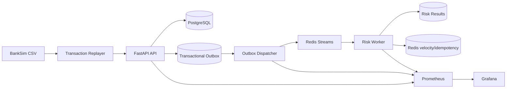
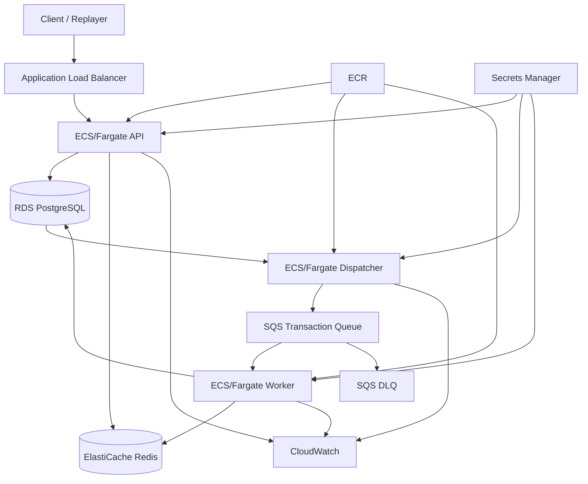

# FraudLatch — Base Project Proposal

| Field | Value |
| --- | --- |
| Status | Baseline / maintained |
| Version | 1.0 |
| Last updated | 2026-09-13 |
| Primary language | English |
| Canonical location | `milestones/00-proposal.md` |
| Execution tracker | [`milestones/0.md`](0.md) |

## 1. Purpose and authority

FraudLatch is a Terraform-first, local-first, event-driven fraud risk platform. This document is the durable starting point for the project: it defines the product story, architecture boundaries, contracts, delivery sequence, and non-goals before implementation begins.

The documents have distinct responsibilities:

1. This proposal defines the approved scope and architecture baseline.
2. [`milestones/0.md`](0.md) is the status board and dependency-aware execution plan.
3. Numbered child milestones define implementation checklists, validation, and measurable acceptance criteria.
4. ADRs record decisions that change an accepted architectural boundary.

When these documents appear to disagree, the implementation must stop at the affected boundary, the proposal and roadmap must be reconciled, and an ADR must be added when the decision is material. A feature must not be added only because it appears in an old example or an external tutorial.

## 2. Executive summary

FraudLatch accepts canonical payment transactions through a FastAPI API, persists the accepted transaction and a transactional-outbox event in PostgreSQL, publishes the event asynchronously through a queue, evaluates deterministic risk rules in a worker, and exposes durable results and operational signals.

The first delivery target is a reproducible local vertical slice:

```text
BankSim source
    ↓ manual acquisition and validation
Canonical Parquet
    ↓ deterministic replay
FastAPI ingestion API
    ↓ one PostgreSQL transaction
Transaction + transactional outbox
    ↓ dedicated dispatcher
Redis Streams
    ↓ at-least-once delivery
Risk worker
    ↓ acknowledge only after DB commit
Risk assessment and processing history
```

The local environment uses Terraform and Docker for stateful dependencies. API, dispatcher, worker, and replayer processes run from the host Python environment during normal development; reproducible application images are built for release/demo mode and the later AWS phase.

AWS is a deferred adapter and infrastructure phase. It must preserve the local application contracts rather than introduce a second domain implementation.

## 3. Product story

The fictional customer is AcmePay, a fintech platform that wants a fast, explainable risk signal for every payment transaction.

The platform must be able to:

- accept a transaction without waiting for risk scoring;
- retain the transaction when the queue or worker is unavailable;
- process events at least once without duplicating the durable result;
- explain a decision with stable reason codes and an engine version;
- expose pending, completed, and failed result states;
- show backlog, retry, latency, and dead-letter behavior;
- run locally without AWS credentials or paid cloud services;
- move to AWS later without changing the API, event, or worker contracts.

This is an engineering-systems project, not a claim of production fraud accuracy.

## 4. Goals

### 4.1 Primary goals

- Learn and demonstrate Terraform resource lifecycle, state, dependencies, modules, and environment boundaries.
- Build a small but credible asynchronous backend with clear reliability invariants.
- Use a reproducible, licensed synthetic dataset as an event source rather than committing raw data.
- Keep risk scoring deterministic, explainable, versioned, and isolated from transport code.
- Make failures visible through durable state, bounded retries, DLQ handling, metrics, logs, and dashboards.
- Provide a clean path from local Docker infrastructure to AWS services.

### 4.2 Explicit non-goals

The following are outside the baseline and require a new milestone decision:

- Kubernetes, EKS, or a service mesh;
- Kafka, Spark, Airflow, or a feature store;
- complex frontend or case-management UI;
- authentication and authorization for the local demo boundary;
- LLM/GenAI or deep-learning fraud models;
- online model training or retraining;
- multi-region deployment or active-active failover;
- production-scale SLA or capacity claims;
- automatic AWS apply/destroy from ordinary pull requests.

ML comparison, load testing, autoscaling, blue/green deployment, and OpenTelemetry are tracked separately under Milestone 13 and are not MVP gates.

## 5. Success criteria

The local MVP is successful when a maintainer can start the documented dependencies, validate and prepare a local BankSim source, replay at least 1,000 canonical transactions, and observe:

1. accepted transactions persisted in PostgreSQL;
2. one durable outbox event per accepted transaction;
3. dispatcher publication to Redis Streams;
4. worker processing with bounded retry and DLQ behavior;
5. one current risk result per transaction;
6. safe duplicate handling after retries or worker restarts;
7. queryable pending/completed/failed states;
8. structured logs and low-cardinality metrics;
9. a provisioned Prometheus/Grafana view;
10. Terraform recreation and explicit local destroy.

AWS success is a separate gate: an approved environment must support `terraform apply`, image deployment, transaction acceptance, asynchronous processing, result querying, observable health, and manual `terraform destroy` without long-lived CI credentials.

## 6. Architecture baseline

### 6.1 Local components



The API never publishes directly to Redis Streams or SQS. It commits the transaction and its `transaction.received` outbox event together. The dispatcher owns publication. The worker owns risk evaluation and result persistence.

### 6.2 AWS target shape



The AWS shape is intentionally deferred until the local contracts and failure tests are complete. RDS and ElastiCache remain private; only the ALB is exposed through the intended application path.

### 6.3 Responsibility boundaries

| Component | Owns | Must not own |
| --- | --- | --- |
| API | validation, transaction acceptance, DB/outbox commit, queries | synchronous risk scoring or direct queue publication |
| Outbox dispatcher | pending-event polling and queue publication | transaction mutation or risk evaluation |
| Queue adapter | serialization, delivery, acknowledgement, retry/DLQ mechanics | domain scoring rules |
| Worker | event consumption, context lookup, risk evaluation, result transaction | transport-specific branches in domain code |
| PostgreSQL | transaction identity, outbox durability, result state, audit history | ephemeral velocity optimization |
| Redis | Streams, short-lived idempotency optimization, velocity windows | sole correctness boundary |

## 7. BankSim data contract

### 7.1 Acquisition

BankSim is a synthetic dataset and the source is licensed. The documented source is the [BankSim Kaggle dataset](https://www.kaggle.com/datasets/ealaxi/banksim1), licensed as `CC BY-NC-SA 4.0` for the stated non-commercial use.

Acquisition is manual and local:

1. Read the source page and accept its license terms.
2. Download the dataset manually using the contributor’s own Kaggle account.
3. If Kaggle provides an archive, extract it locally.
4. Place only `bs140513_032310.csv` at `data/raw/bs140513_032310.csv`.
5. Run `make data-check`.
6. Run `make data-prepare` only after validation succeeds.

Credentials, the archive, the raw CSV, and processed outputs must never be committed. CI must never fetch or upload the licensed raw dataset. The raw and processed directories are ignored by Git while their `.gitkeep` files preserve the expected layout.

### 7.2 Validation and provenance

Milestone 7.1 must validate at least `step`, `customer`, `merchant`, `category`, `amount`, and binary `fraud` fields. It must detect missing columns, null identifiers/categories/amounts, invalid numeric values, invalid labels, and duplicate source rows without silently deleting them.

Successful validation records:

- source URL and license;
- SHA-256 hash of the exact source file;
- row count and fraud count;
- validation version and timestamp;
- input filename and provenance metadata.

Missing or malformed input must fail with an actionable message and a non-zero exit status.

### 7.3 Canonical conversion

BankSim columns are not the application API contract. Conversion creates a canonical transaction record with separate source and synthetic fields:

```json
{
  "transaction_id": "txn_018f50e0",
  "customer_id": "C123456",
  "merchant_id": "M98342",
  "category": "es_transportation",
  "amount": 84.30,
  "source_step": 42,
  "event_time": "2026-02-12T00:00:00Z",
  "source": "banksim",
  "evaluation": {"is_fraud": false}
}
```

The timestamp contract is deterministic:

```text
event_time = 2026-01-01T00:00:00Z + source_step days
```

The same input and seed must produce the same IDs, event times, source fields, Parquet bytes where supported, and provenance manifest. Optional enrichment such as device or channel data must be explicitly marked synthetic.

The `is_fraud` value is evaluation metadata only. It may be used for offline reports and `--fraud-only` replay filtering, but it must never be sent in the scoring payload or read by the live risk engine.

## 8. API contract

### 8.1 Endpoints

```http
POST /v1/transactions
GET  /v1/transactions/{transaction_id}
GET  /v1/transactions/{transaction_id}/risk
GET  /v1/risks/high
GET  /health
GET  /ready
GET  /metrics
```

The local MVP has no authentication. This is an explicit demo boundary, not a production security claim.

### 8.2 Status semantics

```text
new transaction          -> 202 Accepted
same payload duplicate   -> 202 Accepted
same ID, different data  -> 409 Conflict
invalid request          -> 422 Unprocessable Entity
risk pending/processing  -> 202 Accepted
risk completed/failed    -> 200 OK
unknown transaction      -> 404 Not Found
```

The request model must not accept a ground-truth fraud label. Positive amounts, required identifiers, supported categories, and timezone-aware event times are validated before persistence.

`GET /v1/risks/high` returns only completed HIGH assessments, uses bounded pagination, and has deterministic ordering. `GET /ready` checks the dependencies required by the configured service; `/health` remains a process liveness signal.

## 9. Persistence and migration contract

PostgreSQL is the durable correctness boundary. The schema is created and changed only through Alembic migrations; application startup must not silently create an incompatible schema.

### 9.1 Core tables

`transactions` stores the canonical transaction with a unique `transaction_id`, customer/merchant/category identifiers, `NUMERIC(18, 2)` amount, `source_step`, source metadata, UTC timezone-aware `event_time`, and `created_at`.

`risk_assessments` stores one current assessment per transaction: status (`pending`, `processing`, `completed`, or `failed`), score, level, structured reasons, engine version, attempts, safe error code, and timestamps.

`processing_events` stores the append-only attempt/audit history, including transaction ID, event ID/type, attempt number, status, error code, and UTC creation time.

`outbox_events` stores the durable publication intent:

```text
event_id
event_type
schema_version
occurred_at
aggregate_id
payload (JSONB)
status
attempts
next_attempt_at
published_at
last_error
created_at
```

The transaction and initial outbox row are committed in one database transaction. A duplicate accepted request must not create a second transaction or initial event. Foreign keys and indexes support transaction, risk, audit, and outbox recovery queries.

## 10. Event and queue contract

Domain code depends on a `QueuePort`, not on Redis or SQS APIs. The versioned envelope contains:

```text
event_id
event_type
schema_version
occurred_at
aggregate_id
payload
```

The initial event is `transaction.received`, schema version `1`, with `aggregate_id=transaction_id`. Unsupported versions and malformed envelopes are rejected with stable error codes and are not silently coerced.

### 10.1 Redis Streams

The local adapter uses:

```text
fraudlatch:transactions:v1
fraudlatch:transactions:dlq:v1
```

Workers share the `risk-workers` consumer group. Messages are acknowledged only after successful downstream processing and a committed result. Pending entries are reclaimable after a worker restart.

### 10.2 Retry and DLQ policy

There are three total attempts:

```text
attempt 1: immediate
attempt 2: after 1 second
attempt 3: after 5 seconds
then: dead-letter
```

Transient dependency and timeout failures are retryable. Malformed or unsupported events are permanent failures. A DLQ envelope preserves the original event, attempt count, and safe error code. If DLQ publication fails, the source message remains recoverable and is not acknowledged.

The future SQS adapter must pass the same queue-port contract, including visibility timeout, redrive policy, duplicate delivery safety, and DLQ behavior.

## 11. Worker and correctness contract

The worker lifecycle is:

```text
receive → validate → load transaction → load context → assess → persist result/audit → ack
```

The database is authoritative for idempotency. Redis keys may accelerate duplicate checks but cannot replace unique constraints or committed result state. A completed event delivered again must not create another current assessment. A message is never acknowledged before the result and processing history commit.

On graceful shutdown, the worker stops intake, finishes or safely abandons the current message, and allows the queue adapter to reclaim unacknowledged work. An unknown transaction is a controlled permanent failure; database and Redis outages are retryable dependencies.

## 12. Risk engine baseline

The live engine exposes a pure, side-effect-free interface:

```python
assess(transaction, context) -> RiskDecision
```

The first version is `rules-v1` and returns a score in `[0, 1]`, a stable risk level, a non-empty or explicitly neutral reasons list, and the engine version.

Initial explainable signals are:

- `HIGH_AMOUNT` — configured category-aware amount threshold;
- `CUSTOMER_VELOCITY` — customer transaction burst in a five-minute event-time window;
- `MERCHANT_VELOCITY` — merchant transaction burst in the same window;
- `CATEGORY_RISK` — configured historical category signal prepared offline;
- `AMOUNT_DEVIATION` — deterministic deviation from a customer’s historical amount baseline.

Risk levels are stable:

```text
LOW: score < 0.40
MEDIUM: 0.40 <= score < 0.70
HIGH: score >= 0.70
```

Velocity state uses Redis Sorted Sets with keys:

```text
fraudlatch:velocity:customer:{customer_id}
fraudlatch:velocity:merchant:{merchant_id}
```

Entries are scored by canonical event time and expired outside the five-minute window. Cold starts and zero-variance amount baselines have documented neutral behavior. BankSim fraud labels are never features in the live scorer.

## 13. Local development and Terraform

### 13.1 Development mode

The default edit/test loop runs API, dispatcher, worker, and replayer from host Python. Terraform manages local stateful dependencies:

- PostgreSQL;
- Redis;
- Prometheus;
- Grafana;
- the shared Docker network and persistent volumes.

Release/demo mode additionally builds API, dispatcher, and worker images. Images use the same dependency contract, run as non-root where practical, receive configuration through environment variables, exclude secrets/raw data/state, and handle SIGTERM correctly.

### 13.2 Command contract

The command names are defined before implementation and are added to the Makefile as their milestones become available:

```text
make setup
make quality
make format
make format-check
make lint
make typecheck
make test
make terraform-fmt
make terraform-validate
make infra-init
make infra-plan
make infra-up
make infra-down
make data-check
make data-prepare
make api
make dispatcher
make worker
make replay
make docker-build
```

No local command downloads BankSim automatically. AWS apply/destroy remains an explicitly manual, environment-protected operation and is not part of the initial local Makefile contract.

### 13.3 Terraform roots

The local root is `infra/terraform/local`. It pins Terraform and the Docker provider, commits `.terraform.lock.hcl`, defines network/volume/container dependencies, exposes safe outputs, and supports `init`, `fmt`, `validate`, `plan`, `apply`, and `destroy`.

The AWS phase uses separate roots for:

- `infra/terraform/bootstrap/state` — protected S3 state bucket, versioning, encryption, public-access block, and S3 lockfile;
- `infra/terraform/environments/aws-dev` — network, IAM, secrets, ECR, ECS, ALB, RDS, ElastiCache, SQS, and CloudWatch;
- reusable modules under `infra/terraform/modules`.

Application images may be managed by local release/demo Terraform and are published to ECR only in the deferred AWS phase.

## 14. AWS security and operations boundary

AWS resources are private by default and tagged with at least `project`, `environment`, `owner`, and `managed_by`; an optional `ttl` or budget control protects ephemeral demos.

IAM follows service responsibility:

- API: only required secret/database/Redis access; no `sqs:SendMessage`;
- dispatcher: scoped outbox access and `sqs:SendMessage`;
- worker: scoped `ReceiveMessage`, `DeleteMessage`, and `ChangeMessageVisibility` plus required secrets;
- no wildcard `Action=*`/`Resource=*` permissions.

GitHub Actions use OIDC and short-lived credentials only for manually triggered, protected AWS environments. Ordinary pull requests receive no AWS secrets. Dependency Review is required only when Dependency graph and repository entitlements support it; unsupported repositories document the limitation and do not make a permanently failing check required.

The AWS demo must include CloudWatch logs, queue depth, task health, API/worker error rate, processing latency, alarms, a budget alarm, and a manual apply-to-destroy runbook.

## 15. Observability contract

Metrics use the `fraudlatch_` prefix and low-cardinality labels. Transaction IDs, customer IDs, merchant IDs, and raw payloads must not be metric labels.

At minimum, instrumentation covers:

- received, processed, fraud-detected, failure, retry, and DLQ counters;
- request, queue, processing, and outbox latency measurements;
- outbox backlog gauge;
- API, dispatcher, and worker component dimensions.

Structured JSON logs include `event_id`, `transaction_id`, `component`, `attempt`, `status`, `duration_ms`, and safe error code where available. `/health`, `/ready`, and `/metrics` remain separate concerns.

The local monitoring stack provisions Prometheus scraping and a Grafana dashboard without manual dashboard import. The dashboard shows throughput, latency, risk-level distribution, failures, outbox backlog, and DLQ count, including meaningful empty/zero-traffic states.

## 16. Testing strategy

Testing is part of the architecture, not a final polish step.

### 16.1 Unit and contract tests

Fast tests cover Pydantic validation, event envelopes, deterministic IDs/timestamps, rules and score boundaries, amount baselines, idempotency semantics, retry classification, and negative label-leakage cases. Unit tests use ports and fakes rather than concrete PostgreSQL or Redis clients.

### 16.2 Integration tests

Testcontainers provides disposable PostgreSQL and Redis instances. Tests run Alembic migrations, exercise transaction/outbox atomicity, Redis Streams publish/receive/ack, worker persistence, and teardown isolation without relying on developer services.

### 16.3 Failure and end-to-end tests

The full local flow is tested with at least 1,000 replayed transactions and controlled failures:

- duplicate transaction and duplicate event;
- PostgreSQL restart;
- Redis restart;
- worker crash between receive and acknowledgement;
- queue outage and retry exhaustion;
- poison message and DLQ inspection;
- interruption between publish and outbox update;
- query of pending, completed, failed, and high-risk results.

The tests must demonstrate no silent data loss, one current result per transaction, and bounded retry behavior.

## 17. Dependency-aware delivery sequence

The numeric IDs below are stable links. The queue adapter must be implemented before the outbox dispatcher even though the dispatcher belongs to parent milestone 3.

| Stage | Milestones | Purpose | Gate |
| --- | --- | --- | --- |
| Foundation | 1.1–1.4 | language, proposal, Python, command contract | repository is reproducible |
| Persistence/API | 2.1–2.2 | schema, migrations, ingestion/query contract | accepted transaction is durable |
| Queue | 4.1–4.3 | port, Redis Streams, retry/DLQ | local delivery contract works |
| Outbox | 3.1–3.2 | atomic event write and dispatcher | every accepted event is recoverable |
| Risk | 5.1–5.3 | deterministic rules, velocity, amount deviation | explainable decision is stable |
| Worker | 6.1–6.2 | lifecycle, idempotency, result/audit persistence | async result is durable |
| Data | 7.1–7.3 | acquisition, conversion, replay | deterministic source reaches API |
| Observability | 8.1–8.2 | metrics, logs, Prometheus, Grafana | pipeline is inspectable |
| Local infrastructure | 9.1–9.4 | Terraform services and application images | local environment is reproducible |
| Testing | 10.1–10.3 | unit, integration, failure/E2E | reliability claims are executable |
| Repository controls | 11.1–11.2 | CI, security settings, environment rules | merges have a trustworthy gate |
| AWS phase | 12.1–12.4 | SQS, remote state, network/IAM, ECS | cloud smoke test passes |
| Stretch backlog | 13.1–13.5 | ML, load, autoscaling, blue/green, tracing | optional work stays outside MVP |

Milestone status is never inferred from elapsed time. A child becomes `Complete` only after its acceptance criteria are verified and the matching row in `milestones/0.md` is updated. AWS-dependent items remain `Deferred`; `Blocked` is reserved for a real external dependency.

## 18. Accepted architectural decisions

1. **Local-first delivery:** the local vertical slice is the first release target; AWS follows it.
2. **Asynchronous risk processing:** ingestion returns acceptance, not a synchronous risk result.
3. **Transactional outbox:** transaction and event intent are committed atomically.
4. **Queue abstraction:** Redis Streams is the local adapter; SQS is a later adapter behind the same port.
5. **At-least-once delivery:** duplicates are expected and made safe through durable idempotency.
6. **PostgreSQL authority:** unique transaction identity and committed risk state are the correctness boundary.
7. **Rules before ML:** `rules-v1` is the live baseline; ML starts only as an offline comparison.
8. **Label isolation:** `is_fraud` is evaluation metadata and never a live scoring feature.
9. **Manual licensed-data acquisition:** raw BankSim is never automatically downloaded or committed.
10. **Host development plus release images:** fast edits use host Python; images are validated for demo/AWS execution.
11. **Manual cloud lifecycle:** AWS changes require explicit workflow dispatch, environment approval, OIDC, cost controls, and destroy evidence.
12. **English repository:** source, docs, issues, pull requests, commands, and operational messages use English.

These decisions remain in force until an ADR and the roadmap record a deliberate change.

## 19. Risks and mitigations

| Risk | Mitigation |
| --- | --- |
| Licensed source is unavailable | Manual acquisition instructions, missing-file errors, provenance manifest, no CI download |
| Queue outage after API acceptance | Atomic outbox and restartable dispatcher |
| Duplicate delivery | DB uniqueness, current-result upsert, acknowledge-after-commit |
| Poison message | Error classification, three attempts, DLQ envelope and metrics |
| Redis outage | Retryable dependency classification; PostgreSQL remains authoritative |
| AWS cost drift | `aws-dev` approval, budget alarm, TTL/cost tags, manual destroy |
| Unsupported GitHub security feature | Document support boundary and keep unsupported checks non-required |
| Scope expansion | New work requires a numbered milestone and proposal/ADR review |

## 20. Start-here checklist

Before writing application code, a contributor should:

1. Read this document and [`milestones/0.md`](0.md).
2. Read ADR `docs/decisions/0001-project-language.md` and repository security rules.
3. Complete or verify Milestones 1.1, 1.2, 1.3, and 1.4.
4. Install local tooling with `make setup` and verify the quality contract.
5. Begin schema work in 2.1 only after the migration boundary is agreed.
6. Acquire BankSim manually only when starting the data pipeline in 7.1.
7. Do not request AWS resources before the local flow and failure tests are complete.

## 21. Change-management rule

This proposal is a maintained baseline, not an unbounded backlog. A proposed change must state:

- which goal or contract it affects;
- why the existing boundary is insufficient;
- which milestone(s) and acceptance criteria change;
- whether a new ADR is required;
- what is explicitly not being added.

The maintainer updates the version and date in this document when the baseline changes, then updates `milestones/0.md` and affected child documents in the same change.

## 22. Baseline definition of done

This proposal is considered an effective project baseline when:

- the canonical file remains under `milestones/00-proposal.md`;
- `milestones/0.md` links to it and contains the complete status board;
- every planned implementation item has one numbered child milestone or is explicitly out of scope;
- local, AWS-deferred, security, data, and testing boundaries are documented;
- no implementation begins by silently changing the contracts above.
